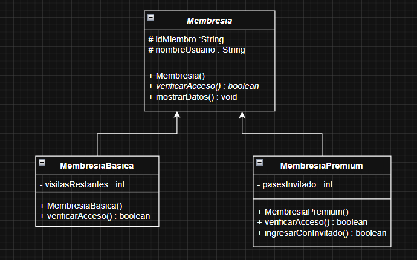
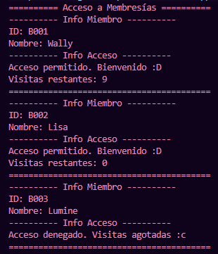
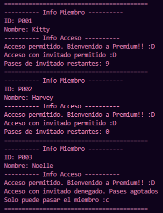
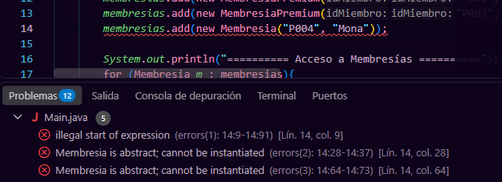

# Actividad: Sistema de Control de Acceso para Gimnasio

## Descripción

Sistema de control de acceso para un gimnasio desarrollado en Java.
El proyecto implementa diferentes tipos de membresías, cada una con
reglas específicas para controlar el acceso de los usuarios:

- `Membresia`: clase abstracta que contiene los atributos y métodos comunes para todas las membresías.
- `MembresiaBasica`: controla el número de visitas disponibles.
- `MembresiaPremium`: permite acceso ilimitado y administra pases para invitados.
- `Main`: contiene las pruebas del sistema y demuestra el polimorfismo mediante un `ArrayList<Membresia>`.

## Diagrama UML

## Funcionamiento

### Membresía Básica

La membresía básica cuenta con un número limitado de visitas.
Cada vez que el usuario obtiene acceso, se descuenta una visita.

Si no quedan visitas disponibles, el acceso es rechazado.

### Membresía Premium

La membresía Premium permite el acceso del usuario sin límite de
visitas.

Además, cuenta con un número determinado de pases para invitados.
Cada vez que un invitado ingresa, se consume uno de estos pases.

Si no quedan pases disponibles, el miembro puede ingresar, pero el
invitado no.

## Polimorfismo

El programa utiliza un `ArrayList<Membresia>` para almacenar objetos
de `MembresiaBasica` y `MembresiaPremium`.

Al recorrer la lista y llamar a `verificarAcceso()`, cada objeto ejecuta
la implementación correspondiente a su propia clase.

## Pruebas

### Membresía Básica

Para ambas membresías, se realizaron pruebas con casos donde los miembros tenían 10, 1 y 0 visitas/pases restantes, demostrando el comportamiento esperado en cada caso.

### Membresía Premium

### Prueba con la clase abstracta

Se intentó instanciar directamente la clase `Membresia` para comprobar
que, al ser una clase abstracta, Java no permite crear objetos
directamente de ella.

## Uso de IA

Se utilizó inteligencia artificial como herramienta de apoyo durante
el desarrollo de la actividad para:

- Resolver dudas sobre el diagrama UML, permitiendo una mejor comprensión de la estructura del sistema.
- Comprender el uso de `protected` y su diferencia con `private`, lo que facilitó la correcta implementación de la herencia y el encapsulamiento.
- Aprender a implementar correctamente `ArrayList` e `instanceof`, asegurando un manejo adecuado de las colecciones y el polimorfismo en Java.

La implementación, revisión y decisiones finales del código fueron realizadas por mí, lo que me permitió entender mejor los nuevos conceptos vistos en clase.